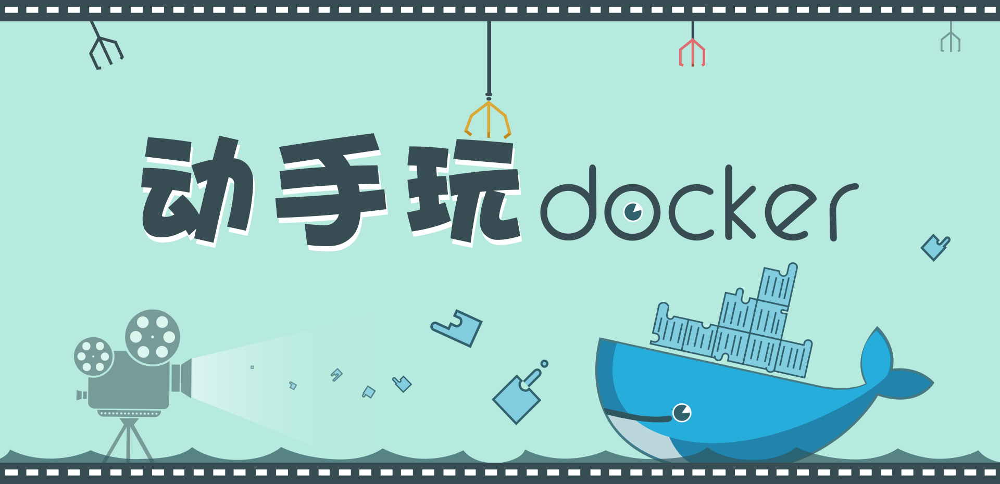

#### 课程名称：
《动手玩Docker》

#### 一句话简介
手把手教你玩转Docker，构建自己的Docker应用。

#### 课程简介
[`Docker`](http://www.docker.com) 是当前最火热的开源项目之一，它提供了一种打包、输送、运行任意应用的容器解决方案。本课程将带你走进Docker的世界，从安装到运行，从构建到部署，手把手教你构建自己的Docker应用。

#### 课程须知
有使用过UNIX家族系统最好，比如Linux或者Mac OS，或者至少能熟练的使用命令行。编码语言不限，有用过Java、PHP、Ruby等一种以上编程语言就更好了。如果自己还做过应用部署和静态页面部署，那学起来将会得心应手。本课程的核心观众，是没怎么用过Docker，但想上手玩玩Docker的新手。

#### 学到什么
带你走进Docker的海洋，首先你能对Docker有一个的基本认识，之后能在主流操作系统下安装部署Docker的，学会使用docker-machine，学习使用docker的基础命令，下载docker的镜像，运行docker的容器，以及掌握Docker的构建利器Dockerfile。最后结合实际应用和蜂巢平台，我们能通过Docker部署的静态网站和Web相关应用，并掌握Docker作为容器解决方案的核心思想。

总的来说，这是一门重实践，轻理论的课程，最终是希望你能动手把Docker玩起来，畅游在互联网的海洋中。

#### 讲师介绍
Hi， 我是 [`兵戈（BingoHuang）`](http://xbing.me)，属于网易蜂巢团队中的一员，喜爱云计算和Docker技术。在这门课程里，让我来和你分享Docker好玩的地方，一起动手玩Docker吧。欢迎随时与我交流（bingo@xbing.me)。

以下是课程章节：(持续更新中)

**第 1 章 课程介绍**

3课时
阐述本课程的简介、内容、须知及适合观众

**第 2 章 Docker 环境安装**

5课时
介绍如何在不同的操作系统（Linux/Windows/Mac）中，安装 Docker 环境。

**第 3 章 Docker Machine**

3课时
介绍 Docker Machine 的基础操作，快速搭建 Docker 环境，并运行Docker容器

**第 4 章 Docker Engine**

3课时
介绍 Docker Engine 的基础命令，拉取镜像，运行容器，快速上手 Docker 操作

**第 5 章 Docker + Nginx: 快速部署静态网站**

2课时
Docker + Nginx + HTML：部署一个简单的静态网站

**第 6 章 Docker + Spring Boot: 快速搭建和部署Web应用**

2课时
Docker + Spring Boot： 快速搭建和部署Web应用
